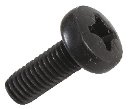

# Form FIT Function

... describe the characteristics of a part.

Such a description can be used in manufacture or replacement scenarios.

Take this fastener, for example:



Its _form_ may be characterized by
shape, weight, volume, thread-pitch and so on - before and after fastening.

Its _fit_ would depend on the thread that receives it

Its _function_ would be to fasten something, of course.

Using these characteristics, we can replicate its usage wherever
'fastening' is required.
We can replace it too.

Or can we?

Consider the 'fit' part of the story.
Is it enough if it fits the receiver thead?
No, here is a bunch of other aspects to consider:

It may be part of a bigger system,
which needs to be assembled with limited tools.
So the type of the **screw head** is important.

It must neither corrode, nor pollute. So it must be **blackened**.

What about the 'function'?
This part must function with certain load, heat, vibration and a lifetime...

You can see that even for a small part like this,
a _complete specification_ is hard.

## Software form-fit-function

Can we make software replaceable by characterizing it?

While Software doesn't have a physical form,
The resources consumed by a software may be considered its _form_.
As long as the resources of space and time are provided,
it can run.

However, software continuously deforms -
built with changing dependencies and runs in many different states.

> Dynamic analysis can recognize the effect of these changes early.

The software will _fit_ in an environment when
its interfaces are accessed as expected.
It also has to feel familiar to its users, maintainers, and ops .

> Reduce ambiguity; Measuring 'least surprise'

The software _functions_ according to what we tell it to do.
However, the functionality experienced is not only the code we write,
but also the behavior of all dependencies.

> 

For instance, take the class that increments the number of visits:

```python
class VisitCounter:
    visitCount = 0
    def oneMoreVisit(self):
        self.visitCount += 1

def afterAVisitTheCountMustBeOne():
    visits = VisitCounter()
    visits.oneMoreVisit()
    assert visits.visitCount == 1

afterAVisitTheCountMustBeOne()
```

How about overflows?

When should it reset?

Should it remember across restarts?

How do we handle mistaken increments?
