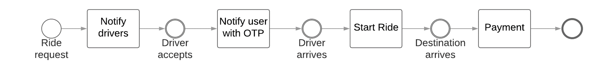
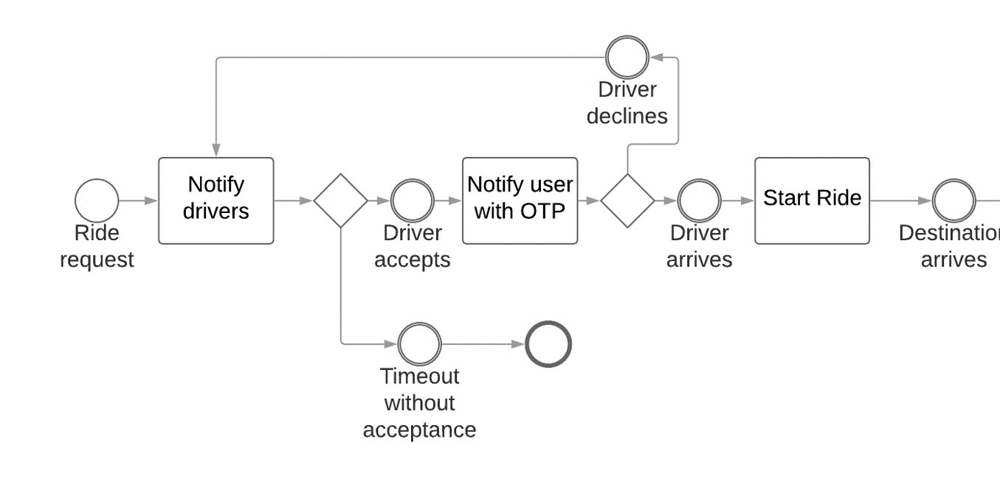
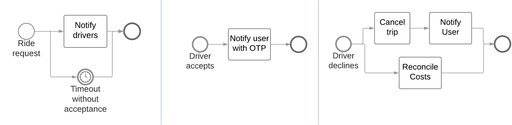

# Mapping the business flows

## Sample cab-booking happy flow

`Exercise: BPMN for comissioning a visit-counter - happy flow`

## Sample complexities in cab-booking

`Exercise: Rescheduling of visit-counter installation`

## Simplification into functions

## Added benefit: Isolating scope

`Exercise: Make the scope explicit in the installation solution via function-isolation`

> Let the consumer reason the out-of-scope easily. Avoid the need to assume.
