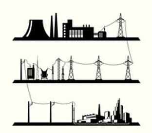
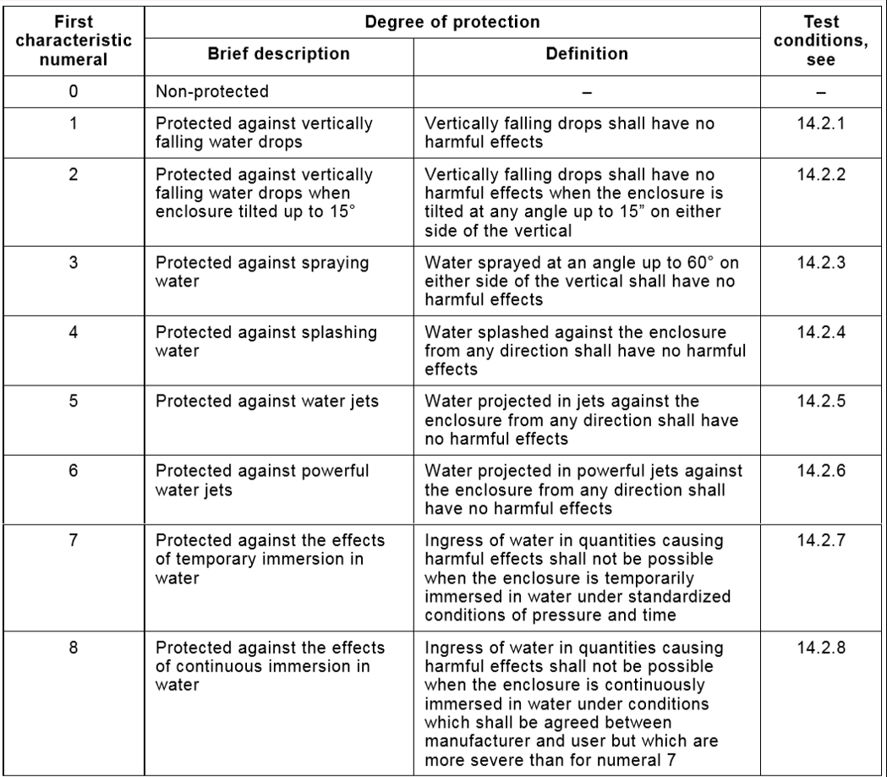
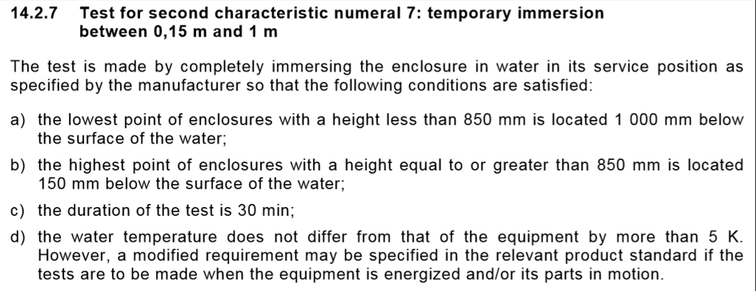

# Modeling needs

## Modeling to Understand

### Use-case: Power auction

Terms: Power, Transmission-loss, Renewable, Capacity, Demand, Auction

Analogy = e-bay

### Smaller analogies

- Register for conference & pay = shopping cart
- MQTT 'at least once' delivery = movie streaming
- MQTT 'fire and forget' = live telecast
- SQL = rows+columns
- MongoDB = documents
- JSON = hierarchical

---

`Exercise: What's an analogy for the site-installation of our visit-counter?`

## Modeling for Commitment

Examples:

- Requirement for a safety component in aeronautics = redundancy + fault-recovery
- Intended use of clinical equipment
- Regulatory claims and ratings

Hardware example: IPX rating

## References

[INCOSE Guide for Writing Requirements](https://tcsd.instructure.com/files/99427/download?download_frd=1)

[IREB Foundation](https://www.ireb.org/content/downloads/2-syllabus-foundation-level/ireb_cpre_syllabus_fl_en_v222.pdf)

[Sharpening Natural Language Specification with Ontologies](https://ps.ipd.kit.edu/downloads/za_2010_natural_language_specification_improvement.pdf)
