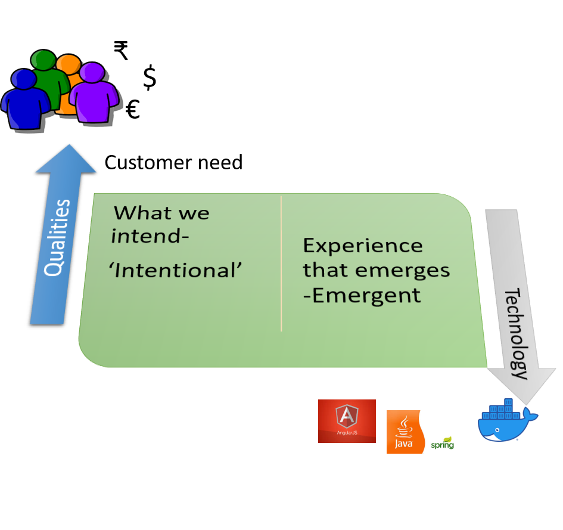
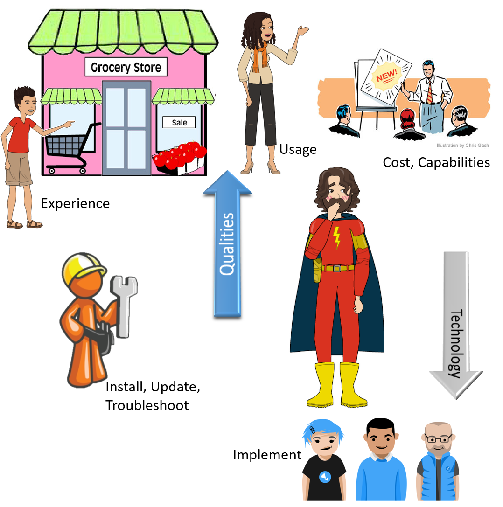

# Challenges

Customers see the effect of our code. That's what they pay for.
Why write requirements?

- why?
- why?
- why?

`Exercise: You want to buy an apartment. What do you need?`

- what?
- what?

`Exercise: Your customer owns a store and needs to count visitors. What do they need?`

- what?
- what?

## Challenge #1: Forces

## Challenge #2: Stakeholders

`Exercise: Who do you need for success? What do they need to do?`

- who? what?
- who? what?

## Challenge #3: Customer's Customer

`Exercise: How can 'counting' help visitors?`

- how?
- how?

## Challenges summary

