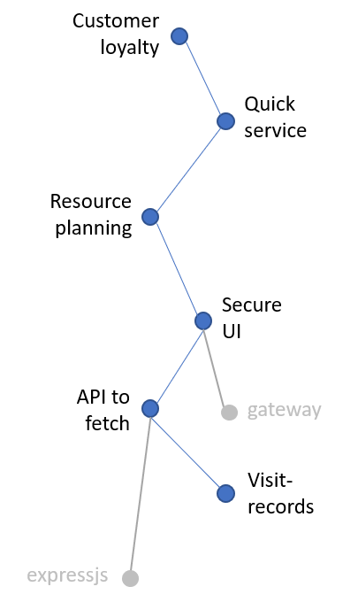

# Elicitation

...the process of getting information from someone

> Requirements are powerful when they are in a coherent model,
> reflecting business reality

## As a Buyer

### RFI = Request for Information

...getting to know the domain

### RFP = Request for Proposal

...options, price, choices

### RFQ = Request for Quote

...decisions, processes, deliveries

## As a Provider

### Observation / Ethnography

How do you list the items you will observe?

- how?
- how?

How do you group?

- how?

How do you know you are covering all groups?

- how?

How do you observe?

Longevity | Customer value | Business value
---|---|---
 | | 

### Challenge & Question

- Commit to a customer-value and a business-value
- Start with common knowledge
- Can-do and Like-to-do
- Control expectations

> Avoid challenging an individual in the presence of a group!

### Brainstorm with Focus Groups

- Set the focus to target
- Set the deliverable = Content & Level of Acceptance Criteria
- Look outside: Conferences, Competition, Prior-art

### Interface / Acceptance analysis

- Align stakeholders for sign-off
- Absence of alignment = Validate!
