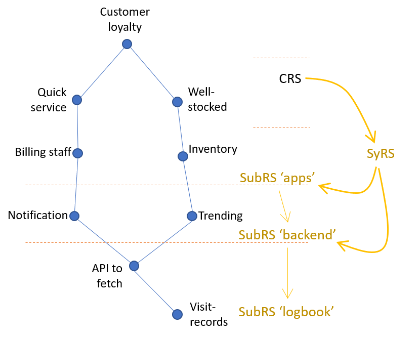
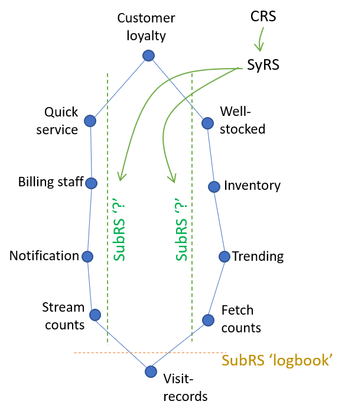

# Decomposition of the Problem

To participate in the value chain, responsibilities of the System
can be decomposed horizontally **and** vertically

## Horizontal

## Vertical and Horizontal

> Vertical slicing enables closer customer-engagement.
> It is the favorite tactic of the 'Digital Transformation' game.
