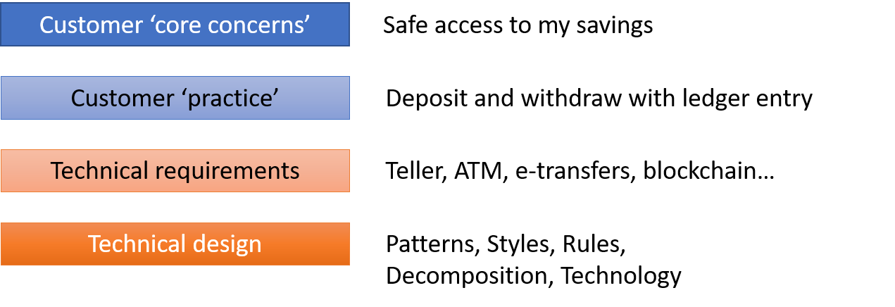
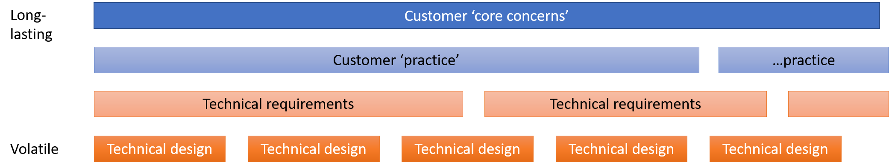

# Lifecycle hierarchy of user-needs

## Sample customer needs - Banking

### Concepts closer to the customer live longer

> Tip: Keep life-cycles separate

`Exercise: Lifecycle of needs in a store-visit-counter`

## Specifying Customer Needs

Use a story or a context

<!-- markdownlint-disable MD013 -->

Requirement | Context | Specification
---|---|---
No memory leaks | Mobile Ultrasound, continuous operation for 2 days max | X no. of cycles without deterioration of performance, stable working-set and commit-charge not exceeding 3.5 GB
No training required | ATM front-end | Start-screen same as previous version
X-ray latency <1 second | Used during surgery | One in 20 measurements can go above 1 second, with max not exceeding 2.5 seconds

How about regulatory requirements?

Regulation | Context | Specification
---|---|---
Data Privacy in car entertainment systems | Consequence of misuse: Loss of branding & trust | Hardware-level encryption
Medical images during treatment | Entry-restricted operation theater | None
Salary data in HR workplace | Confidentiality breach | Screen-saver + privacy filter screen
Face-recognition to count visits | Same as CCTV in store | Agreement with store-owner

## Recognizing the solution-scope

Any Product Quality will have dependency on the environment or the user.

> Clarify product responsibility vs user's responsibility.

`Exercise: Call the out-of-scope items from the` [customer context](modeling-needed-capabilities.md)
