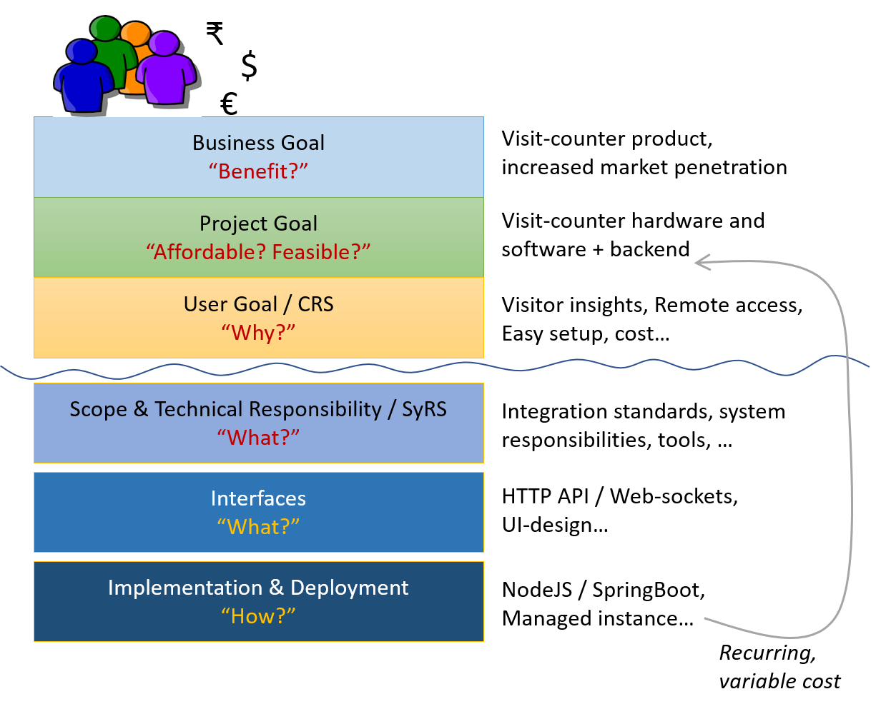

# Relating to Stakeholders

## Stakeholder

...a person with an interest or concern in something, especially a business.

> In your project, you are a stakeholder!

`Exercise: List the stakeholders in your project`

## Mapping Stakeholders

`Exercise: Map the stakeholder-value delivered by your project`

## Stakeholders Evolve

People change:

- After using the product, goals become clearer
- After using another product, expectations change

[The requirements are alive!](modeling-live-requirements.md)

## Obstacles to Evolution

### Complexity in Requirements

`Exercise: What's wrong with this use-case?`

**Goal**: User login

**Primary Actor**: Store owner

**System**: Reporting backend

**Steps**:

1. Store owner enters user-name and password
2. Store owner presses login button, triggering request to the backend
3. Store owner sees the reports of their store

**Extensions**:

1a. Wrong credentials: Store owner sees message to retry. Back to step 1

1b. Blocked account: Store owner told to contact admin

**Variations**:

Owner of a store-chain will see consolidated reports instead of a single store

---

### Contradictions hidden by Ambiguity

**Sample Ambiguous Statement**,
motivated by data-ownership and cloud-capability:
The Store owner shall always have access to their reports.

`Exercise: What does it contradict with, in the above use-case?`

---

### The Remedy

Try a [functional decomposition of business flows](modeling-business-flows.md)
to overcome these obstacles.

`Exercise: Make a functional decomposition of the above user-login use-case`
