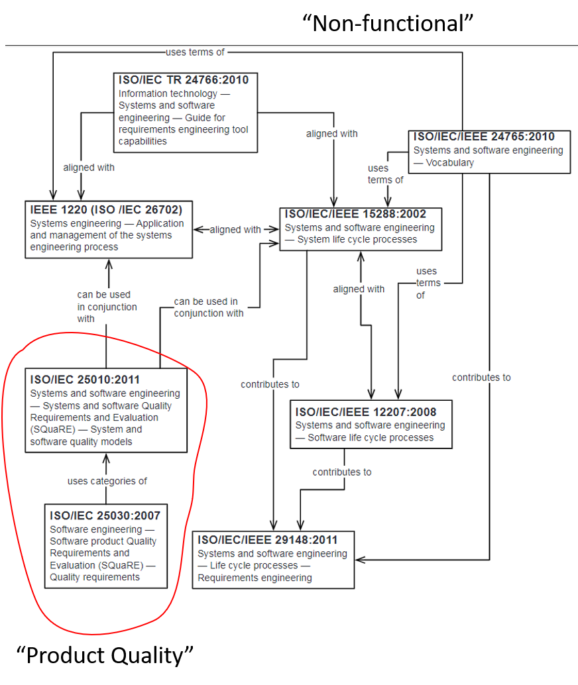

# Standards for Modeling Needs

## Terminology - "Non-standard"

[ISO/IEC 25010](https://pdfs.semanticscholar.org/57a5/b99eceff9da205e244337c9f4678b5b23d25.pdf)
lists product quality attributes.

[IREB](https://www.ireb.org/en/about/) collects practices around Requirements Engineering

## Summary

We are still far from a standard. A lot depends on craftsmanship and best-practices.

In fact, Requirements Engineering is 'a thing' in software
due to the close iterations and constant bridging
