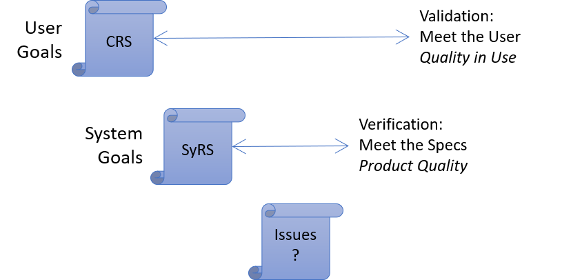
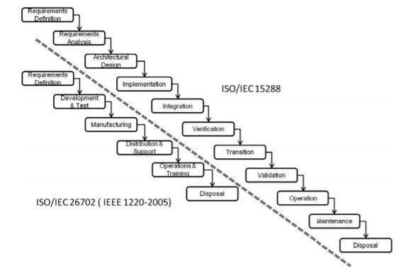

# Reality Sync

It is common to see requirements drift away.
How do we keep the requirements useful?

## Bidirectional Tracing

...modeling links in both directions.
It is common when a hierarchical approach is taken for system-decomposition.
It opens both
[opportunities and difficulties](modeling-needs-tracing.md).

## Decomposition

Requirements can be decomposed in
[Hierarchical and Vertical](modeling-needs-horizontal-vertical.md)
ways.

## Typical Requirement Workflow

## Strategies for Success

- [Hierarchy with bidirectional tracing](modeling-needs-tracing.md)
- [Tracking-tools with approval-workflow](modeling-needs-tools.md)
- [Requirements = Tests](modeling-needs-as-tests.md)
