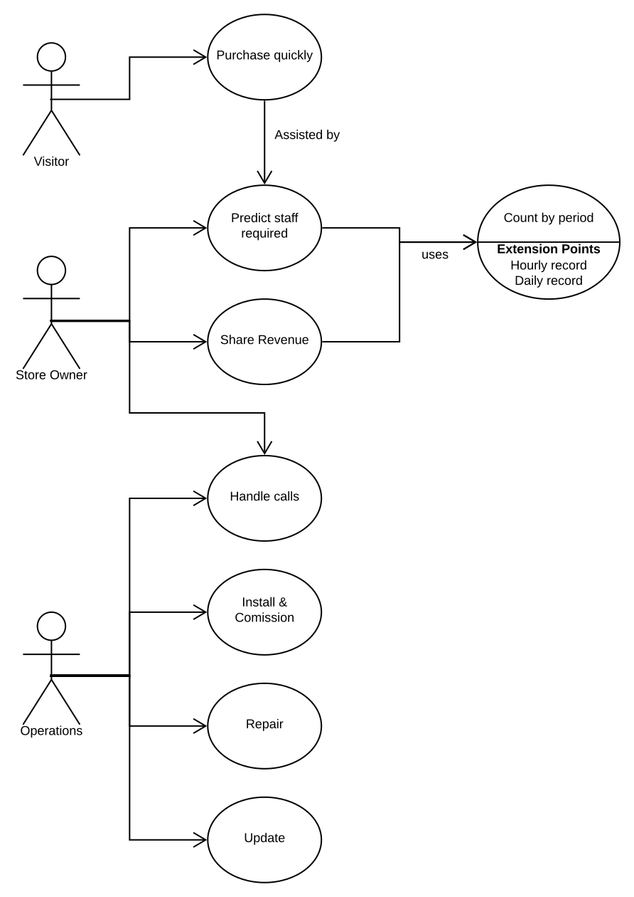

# Techniques for expressing Requirements

Software has been used to solve problems for decades.
Over time, the expectations of customers [have evolved](modeling-needs-evolution-decades.md).

[Standardization](modeling-needs-standards.md) has tried to keep pace.

## Our example: Visit-counter


## UML Use-case diagram



## Use-cases

Use-cases aim to bridge the gap between a customer-need
and its implementable specification.
Ref. book [Writing effective use-cases](https://www.academia.edu/22312187/Writing_Effective_Use_Cases_Writing_Effective_Use_Cases).

**Goal**: Install and Commission Visit-counter in one store

**Primary Actor**: Field engineer

**System**: Installation kit, Backend (cloud) for count-records

**Steps**:

1. Field engineer looks up location of installation
2. Field engineer looks up the order and picks the right kit
3. Field engineer uses tools for installation
4. Field engineer completes hardware installation and power-on
5. Field engineer performs initial test after power-on
6. Field engineer sets up the profile / configuration
7. Backend system sends success notification to Field Engineer and Store-owner

**Extensions**:

2 a. the kit is not available

3 a. Field engineer doesn't have enough tools for a particular site

5 a. Field engineer notes Initial test failure on power-on

`Field engineer looks up logging`

5 b. Improper wiring to camera/backup

5 b. There is no backup power

**Variations**:

Field engineer has to perform Steps 3-6 multiple times

Backend system sends a single notification for the entire installation

---

### Use-cases vs User-Stories

Use-cases may-or-may-not specify the qualities required for acceptance.

## User Stories

User stories capture the user-goal and **Acceptance Criteria**
to distinguish the scope of the solution.

### Example

As Field Engineer, I need installation interface/GUI
to commission the visit-counter software in a store
so that the customer has a full functioning solution.

[**Acceptance Criteria**](modeling-needs-acceptance-criteria.md):

The installation interface shall

- the app shall provide configuration of the software on android & iOS
- the app interfaces with hardware to provide test results -
no false positives and false negatives
- the app shall provide for manual entry of local wifi configuration,
provided power and wifi router are present
- the system shall automatically connect to the backend
- the app shall indicate a successful or unsuccessful connection

---

Acceptance Criteria can be expressed in terms of
[rules or examples](modeling-needs-acceptance-criteria.md)

`Exercise:`
[Acceptance Critique](https://forms.office.com/Pages/ResponsePage.aspx?id=DQSIkWdsW0yxEjajBLZtrQAAAAAAAAAAAANAAY-7brxUM1E3STBTRFlHWUNUVEM4MVkzWDFZTjhYWi4u)

> 'Good' acceptance criteria = lower
[transaction costs](modeling-real-agile.md)

`Exercise:`
[Acceptance Authoring](https://forms.office.com/Pages/ResponsePage.aspx?id=DQSIkWdsW0yxEjajBLZtrQAAAAAAAAAAAANAAY-7brxUM0RGVTBQUlhCSlZDOUFBTTkyODM5WEFNVi4u)

## Behavior Specification

The Acceptance Criteria can be specified as Scenarios:

```BDD
Given a store with an address
When a store-owner requests installation at 2 PM
Then the installation is scheduled from 2-6 PM
 And operations is notified
```

```BDD
Given wired-up hardware with pre-installed software
When the field engineer completes first power-up
 And connects his mobile to the device-hotspot with SSID "v-counter"
Then ....
```

```BDD
Given an installed, powered-up system
When a customer visits the store
Then the visit is recorded
```

> Scenarios can bridge stakeholders across the spectrum

<!-- markdownlint-disable MD013 -->

Customer Requirements | System Requirements | Module Requirements | Implementation | Deployment
---|---|---|---|---
Report on visit counts | Sensor, API & app with authentication | WebServer, Persistence | Record the visit in MongoDB | One-click container

### Downstream effects of Scenarios

- Scenarios can also be used to fine-grain and separate life-cycles.
- The level of fine-graining contributes to the
[real agile practices](modeling-real-agile.md)
in the project
