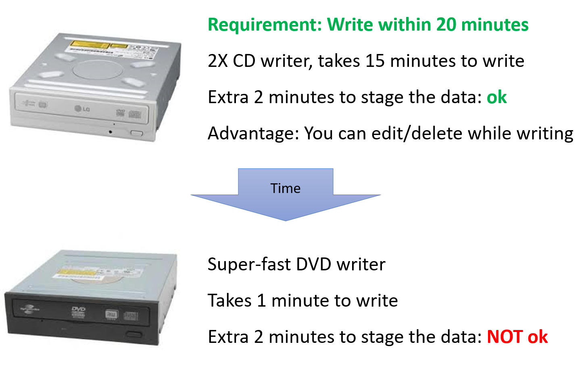

# Validation 'Quality in Use'

...are we building the right thing?

> 'right' could be useful, profitable, valuable, fun, ...

## Continuous Validation

## Early Validation

Artifacts of early validation are:

- Written 'stories'
- Model-simulations
- Wire-frames
- Prototypes

## Validation- Continuous Response

Also called the 'DevOps' flow

Develop > Verify > Release > Monitor > Release

## Pre-release Validation

Validation criteria defined at design time:

- Risk of misinterpretation: Treatment based on wrong patient's diagnosis
- Environmental risk: Temperature and Humidity at work, Power stability,
Network availability, ...
- Usability risk: Training required, Efficiency of users, ...
