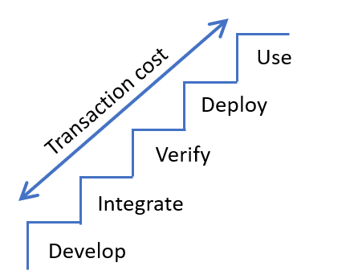
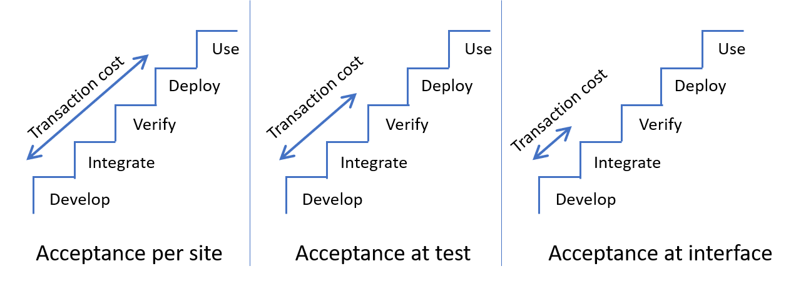
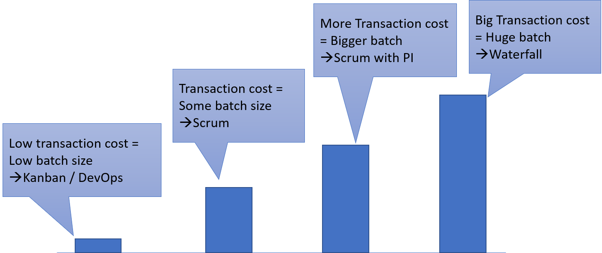

# The Real Agile

## Transaction Costs

The cost of getting an innovation from development to use.

## Effect of Unclear Acceptance Criteria

Example: Software Upgrade

Often, Software upgrades need to migrate data.

- The 'from' and 'to' schemas are well-defined
- However, the context of use may vary from customer to customer.

## Reasons for Unclear Acceptance Criteria

- Faulty Requriements Engineering
- Unknown Integration Scenarios

## Transaction Costs = Batch size

