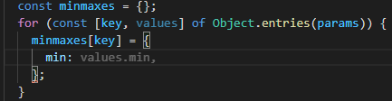
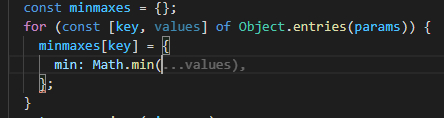
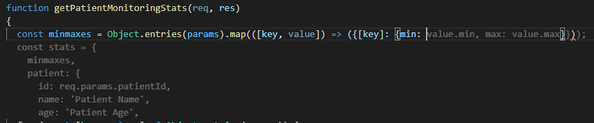
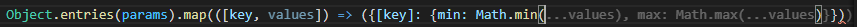
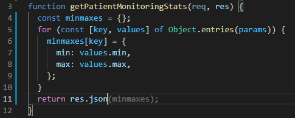
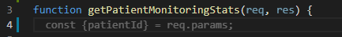
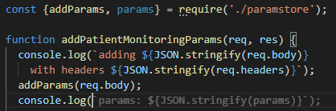
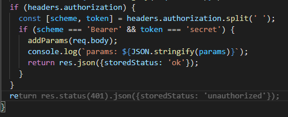

# GitHub Copilot - does it save my time?

Wrong auto-completion. _Auto-complete is usually right… is my node outdated? 4 mins waste_

Auto-completes correctly after typing `Math.min`. _Auto-complete spread-operator, which I usually forget. Saved ~6 mins_

---
AI on steroids + opium...

_Hard to type while it is auto-completing madly… After a little typing, it gets sober_.
Hey, typing `min` triggered `max`... _is it adjusting to my style?_

---
Completes return value... _almost human_

---
_Diversion…_ Where did patientId come from?

---
Picks unused variable and does JSON.stringify for you. _Saves logging rework time ~2 mins_

---
Unauthorized is `401`! Saves a confirmation lookup ~2 mins

